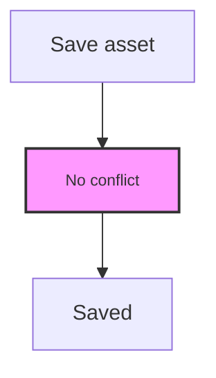

# Mermaid

## Extensions

Markdown Preview Mermaid Support

## Sample Code

```mermaid
graph TD;
    classDef wrapText fill:#f9f,stroke:#333,stroke-width:2px,font-size:12px;

    SaveAsset["Save asset"]
    SaveCheck1["No conflict"]:::wrapText
    Saved["Saved"]

    SaveAsset --> SaveCheck1 --> Saved
```
