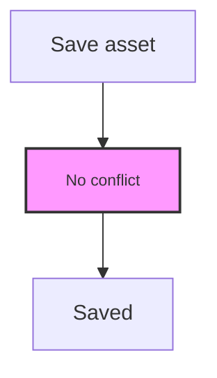
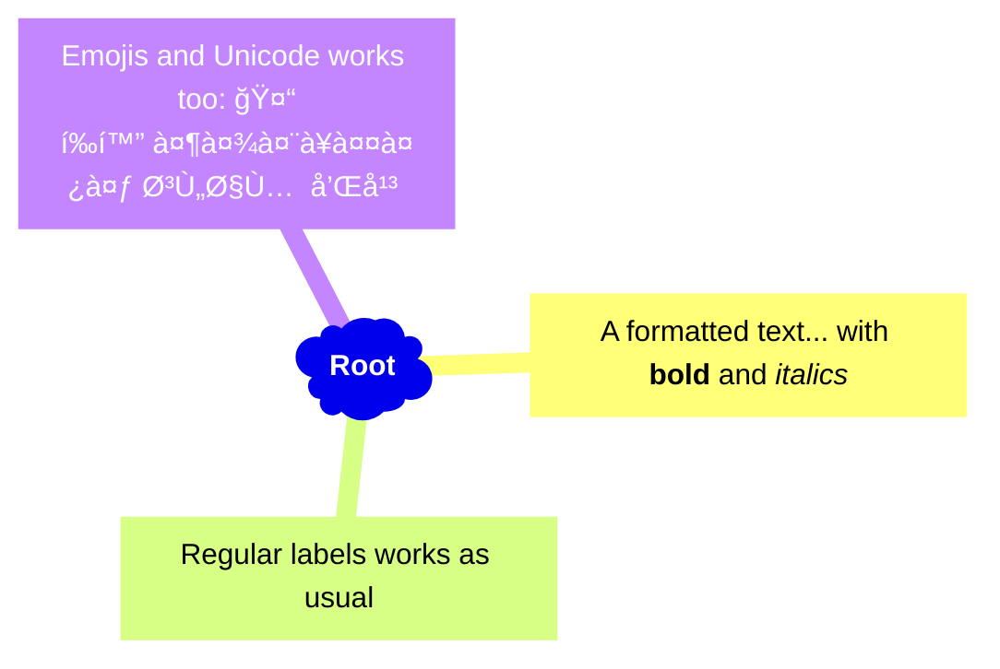
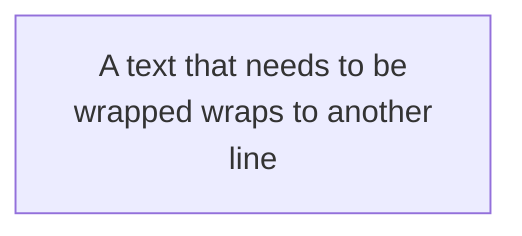
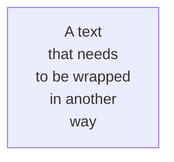

# Mermaid

## Extensions

Markdown Preview Mermaid Support

## Sample Code

```mermaid
graph TD;
    classDef wrapText fill:#f9f,stroke:#333,stroke-width:2px,font-size:12px;

    SaveAsset["Save asset"]
    SaveCheck1["No conflict"]:::wrapText
    Saved["Saved"]

    SaveAsset --> SaveCheck1 --> Saved
```

```mermaid
mindmap
    id1("`**Root**`"]
      id2["`A formatted text... with **bold** and *italics*`"]
      id3[Regular labels works as usual]
      id4["`Emojis and Unicode works too: 🤓
      í‰í™” शानà¥à¤¤à¤¿à¤ƒ سلام  和平 `"]
```

## Text

Wrapped text 1:

```mermaid
flowchart LR
    B[A text that needs to be<br />wrapped wraps to another<br />line]
```

Wrapped text 2:

```mermaid
flowchart LR
    C["`A text
      that needs
      to be wrapped
      in another
      way`"]
```
