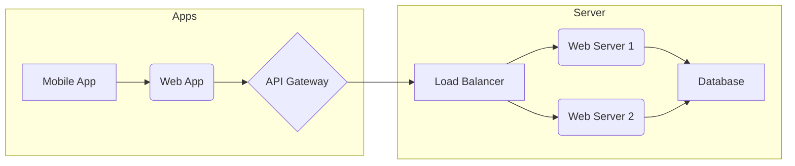

Here's a Mermaid code snippet that creates two horizontally divided sections, "Apps" and "Server", with interconnected flowcharts within each:

```mermaid
graph LR
    subgraph Apps
        A[Mobile App] --> B(Web App)
        B --> C{API Gateway}
    end

    subgraph Server
        D[Load Balancer] --> E(Web Server 1)
        D --> F(Web Server 2)
        E --> G[Database]
        F --> G
        C --> D
    end
```
